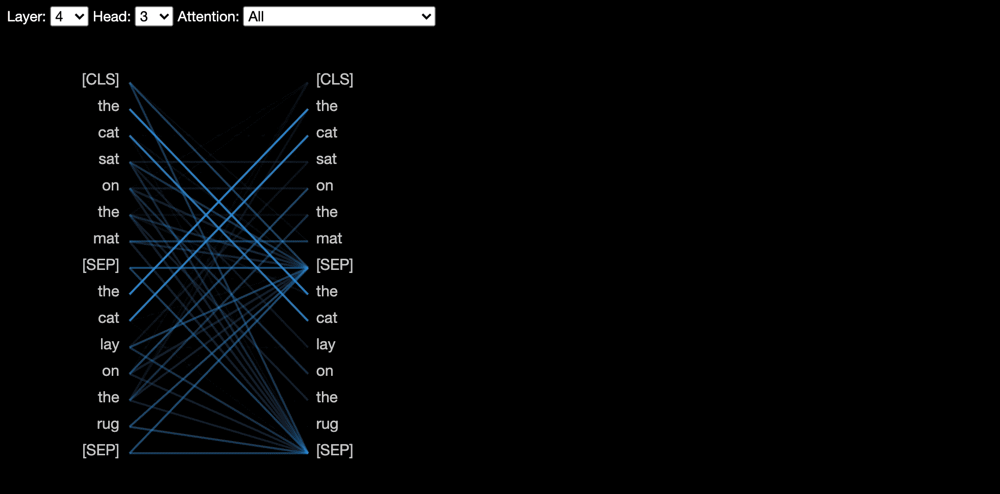
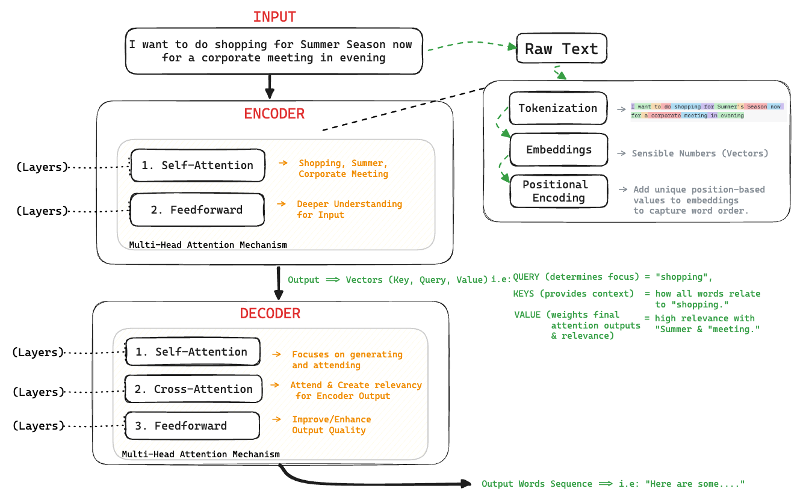

# Neural Network
A Neural Network is a computational model inspired by the human brain, designed to recognize patterns, make predictions, and solve complex problems. It's a key component of machine learning and deep learning.

### Neural Network Basics:
- **Artificial Neurons (Nodes):** Process inputs and produce outputs.
- **Connections (Edges):** Transmit signals between nodes.
- **Layers:** Organized nodes and connections.
- **Activation Functions:** Introduce non-linearity to node outputs.

### Neural Network Components:
- **Input Layer:** Receives input data.
- **Hidden Layers:** Processes and transforms data.
- **Output Layer:** Produces predicted outputs.
- **Bias:** Adjusts node outputs.

### Training Process:
- Initialize ***weights*** and ***biases***.
- Perform ***forward propagation*** to generate predictions.
- Calculate the loss ***(error between predicted and actual values)***.
- Perform ***backward propagation*** to compute gradients.
- Update weights using ***gradient descent*** or an **optimization algorithm**.
- Repeat for multiple ***epochs*** until the loss is minimized.

# Types of Neural Network
### 1. Feedforward Neural Network (FNN):

- Basic neural network where data flows in one direction from input to output.
- **Applications:** Classification, regression.
- **Limitations:** 
    - Training Time
    - Pixel Inequality
    - High Dimensionality
    - Limited Feauture Extraction

### 2. Convolutional Neural Network (CNN):

- Specialized for processing grid-like data, particularly images.
- **Applications:** Image recognition, object detection, video analysis.
- **Limitations:**
    - Needs large data
    - Lacks temporal handling
    - High computation

### 3. [Autoencoder:](/NeuralNetwork.md#types-of-autoencoders)

- A type of neural network designed for data compression, anomaly detection, dimensionally reduction and feature learning.
- **Components:** Encoder, Decoder
- **Applications:** Data compression, anomaly detection.
- **Limitations:**
    - Overfitting
    - Lossy reconstruction
    - Poor data generation

### 4. [Recurrent Neural Network (RNN):](/NeuralNetwork.md#types-of-recurrent-neural-network)

- Designed to recognize patterns in  sequences of data such as time series or natural language.
- **Applications:** Time series prediction, natural language processing (NLP).
- **Limitations:**
    - Vanishing gradients
    - Slow training
    - Limited memory

### 5. Attention Models / Transformers:

- Neural network architecture using self-attention mechanisms, widely used in NLP.
- **Applications:** Language modeling (e.g., GPT, BERT), translation, summarization.

### 6. Generative Adversarial Network (GAN):

- Consists of two networks (generator and discriminator) competing to produce realistic data.
- **Applications:** Image generation, deepfakes, data augmentation.

### 7. Radial Basis Function Network (RBFN):

- Uses radial basis functions as activation functions.
- **Applications:** Function approximation, time-series prediction.

## Types of AutoEncoders

### 1. Vanilla Autoencoder
- **Structure:**  Basic autoencoder with a symmetrical architecture (encoder and decoder).
- **Application:**  Primarily used for dimensionality reduction and feature learning.
- **Limitation:**  Prone to learning trivial mappings, making it less effective for complex patterns.

### 2. Denoising Autoencoder (DAE)
- **Purpose:**  To remove noise from input data.
- **Mechanism:**  Trained by adding random noise to the input data and then reconstructing the original, clean data.
- **Types:**  Guassian noise, Salt and pepper noise
- **Application:**  Useful in image denoising, audio denoising, and data preprocessing.

### 3. Convolutional Autoencoder (CAE)
- **Purpose:**  Designed to work with spatial data like images.
- **Mechanism:**  Uses convolutional and pooling layers in the encoder and deconvolutional (transposed convolution) layers in the decoder.
- **Application:**  Image denoising, image compression, and image generation.
- **Use Case:**  Used extensively in computer vision for learning compact, spatially-aware representations.

### 4. Variational Autoencoder (VAE)
- **Purpose:**  A probabilistic autoencoder that learns a latent distribution instead of fixed encodings.
- **Mechanism:**  The encoder outputs the mean and variance of a Gaussian distribution, and a sample is drawn from this distribution during training.
- **Application:**  Generative modeling, image synthesis, and anomaly detection.
- **Use Case:**  VAEs are widely used for generating new data points that are similar to the input data (e.g., generating new images of faces).

## Types of Recurrent Neural Network

### 1. Simple RNN
- **Definition:** A basic RNN that processes sequences by updating its hidden state at each time step.
- **Use:** Good for simple time-series data but struggles with long-term dependencies.
- **Limitation:** Suffers from vanishing and exploding gradient problems.

### 2. LSTM (Long Short-Term Memory)
- **Definition:** An advanced RNN designed to capture long-term dependencies using memory cells and gates.
- **Components:** Includes forget, input, and output gates that control information flow.
- **Advantage:** Effective in capturing context from distant past inputs, making it suitable for NLP and speech recognition.

### 3. GRU (Gated Recurrent Unit)
- **Definition:** A simplified version of LSTM with fewer gates (reset and update gates) which make it computationally more efficient while still handling long-term dependencies well.
- **Difference:** Has fewer parameters than LSTM, making it faster and easier to train.
- **Advantage:** Provides similar performance to LSTM with reduced computational complexity.

### 4. Seq2Seq RNN (Sequence to Sequence)
- **Definition:**  A specialized RNN used for translating sequences (e.g., text translation).
- **Structure:**  Consists of an encoder (processes input) and a decoder (generates output), both using LSTMs or GRUs.
- **Use:**  Widely applied in machine translation, chatbots, and summarization.

# Activation Functions in Neural Networks

The most popular activation functions in neural networks are:

### 1. ReLU (Rectified Linear Unit)
- Output: 𝑓(𝑥)= max(0,𝑥)
- Use: Widely used in hidden layers of deep neural networks (especially CNNs).
- Reason: Simplicity, computational efficiency, and helps with faster training.

### 2. Sigmoid
- Output: 𝑓(𝑥)=1/1+𝑒−𝑥 
- Use: Common in binary classification and output layers.
- Reason: Converts inputs into probabilities between 0 and 1.

### 3. Tanh (Hyperbolic Tangent)
- Output: f(x)=tanh(x)
- Use: Often used in RNNs and LSTMs for better zero-centered outputs.
- Reason: Zero-centered, better gradient flow than sigmoid.

### 4. Leaky ReLU
- Output: f(x)=x if x>0, otherwise f(x)=0.01x
- Use: Used to overcome "dying ReLU" problem where neurons become inactive.
- Reason: Allows small gradients for negative values.

### 5. Softmax
- Output: Converts logits into probabilities across multiple classes.
- Use: Multi-class classification (output layer).
- Reason: Ensures sum of probabilities equals 1 for class predictions.

### 6. Swish
- Output: f(x)= x/1+e −x
- Use: Newer models like deep learning architectures from Google.
- Reason: Provides better performance than ReLU in some networks.
